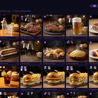

# Norberto Krucheski

[Website ↗](https://norbertok.com) · [LinkedIn ↗](https://www.linkedin.com/in/norberto-krucheski/) · [Email](mailto:contact@norbertok.com)

[← Inicio](./README.md) · [🇺🇸 English](./README.en.md) · [🇧🇷 Português](./README.pt.md)

---

## Español

**Full Stack Engineer & Tech Lead** construyendo productos web, mobile y herramientas con IA aplicada.

Trabajo en la intersección entre producto, arquitectura y ejecución técnica: frontend, backend, mobile, infraestructura, automatización e integración de IA donde realmente aporta valor.

### Proyectos recientes

| Proyecto | Detalle |
| --- | --- |
|  | **[TuMenu ↗](https://tumenu.promo)** · [EN ↗](https://tumenu.promo/en) · [PT ↗](https://tumenu.promo/pt)  Producto para restaurantes con menú digital QR, pedidos por WhatsApp y checkout integrado.  +30 restaurantes activos en LATAM · dashboard en React · menú público en Astro con SSR · APIs independientes en NestJS.  **Stack:** React · Astro · Node.js · NestJS · PostgreSQL · Redis · SSE |
|  | **[Ascend Life ↗](https://ascends.life)** · [EN ↗](https://ascends.life/en) · [PT ↗](https://ascends.life/pt)  Producto de crecimiento personal con planes personalizados, contenido en audio, texto y PDF.  Usuarios pagos desde el lanzamiento · planes de 28 días · pagos con Stripe · retargeting y automatizaciones con Redis.  **Stack:** Next.js · React · NestJS · PostgreSQL · Redis · Stripe · Supabase · PWA |
|  | **[Pixora ↗](https://github.com/NorbertOSK/pixora)**  Herramienta desktop open source para procesamiento local de imágenes.  Redimensionado y conversión · limpieza de metadatos EXIF · remoción de fondos con IA local · procesamiento offline, sin cuentas ni tracking.  **Stack:** Rust · React · TypeScript · Tauri · Vite · Tailwind CSS · ONNX Runtime |
|  | **[Oniria ↗](https://oniria.app/)**  App mobile publicada en App Store y Google Play para registro e interpretación de sueños con IA.  Arquitectura end-to-end mobile + backend · autenticación con Google y Apple · compras in-app · IA generativa.  **Stack:** React Native · NestJS · MongoDB · Redis · OpenAI API |
|  | **[leterme ↗](https://leterme.life)**  Plataforma para guardar mensajes a tu yo del futuro en texto, audio o video.  Cápsulas temporales con apertura futura · plan Pro de pago único · álbum privado asociado a cada cápsula.  **Stack:** Astro · Node.js · NestJS · PostgreSQL |

### Otros proyectos y trabajos visibles

[RitmoVital ↗](https://ritmovital.app/) · [GoJiraf ↗](https://www.gojiraf.ai/) · [Paola Enciso ↗](https://paolaenciso.com/) · [MapApp ↗](https://app-maps.demosweb.net/) · [WordPress Avanzado ↗](https://wordpressavanzado.com/)

### Trabajos y colaboraciones recientes

- **Senior Full Stack Consultant & Product Builder** — productos propios y consultoría técnica desde [norbertok.com ↗](https://norbertok.com).
- **Frontend Tech Lead — GoJiraf** — liderazgo de equipo frontend en plataforma de live shopping usada por marcas como MercadoLibre y Samsung.
- **Frontend Software Engineer — etermax** — desarrollo frontend de alto rendimiento para productos internos de Ads.
- **Frontend Technical Lead — Accenture / Banco Galicia** — definición de estándares React y aprobación técnica formal del proyecto.
- **IT Engineer · Automation & Software — INVAP S.E.** — automatización, tooling e infraestructura crítica para el proyecto nacional de Televisión Digital Abierta.

### Stack principal

React · TypeScript · Next.js · Astro · Node.js · NestJS · React Native · PostgreSQL · MongoDB · Redis · Docker · AWS · Railway · Tauri · Rust · AI APIs

[Volver arriba](#norberto-krucheski)
